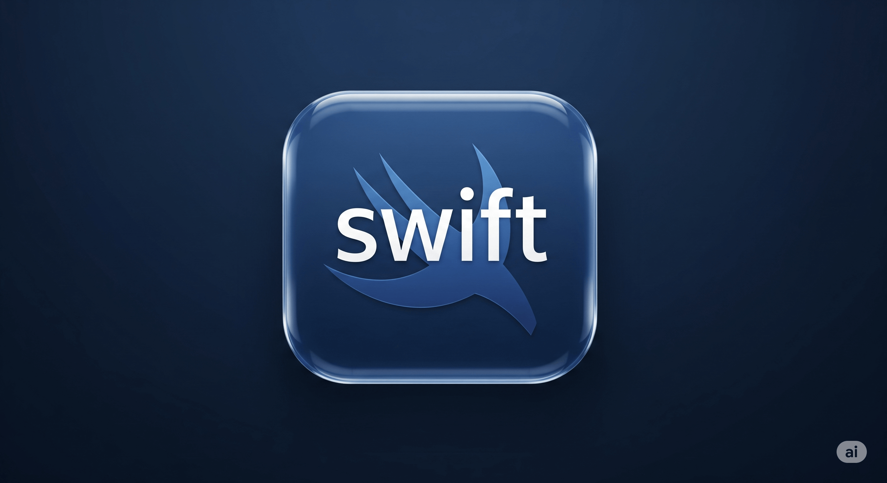

# Linguagem de programação Swift



[](https://github.com/natorsc/swift)
[](https://github.com/natorsc/swift)
[](https://github.com/natorsc/swift)
[](LICENSE)

- [🇺🇸](#). ToDo.
- [🇧🇷](README.md)

## ✨ Sobre este projeto

Este repositório é o seu guia completo para aprender os fundamentos da programação Swift. Seja você um desenvolvedor iniciante ou experiente, encontrará tutoriais práticos, dicas e exemplos reais de código para fortalecer suas habilidades e levar seus projetos para o próximo nível.

Se este conteúdo o ajudou, considere fazer uma doação. Seu apoio faz uma diferença real e ajuda o projeto a crescer! 💙

## 🛠 Tecnologias utilizadas

[](https://www.swift.org/)

## 👨‍💻 Autor

Criado com 💙 por Renato Cruz. Tem alguma dúvida ou comentário? Entre em contato a qualquer momento!

[](mailto:natorsc@gmail.com)

O que estou ouvindo enquanto programo ou estudo 😎🎵:

[](https://open.spotify.com/playlist/1xf3u29puXlnrWO7MsaHL5)

## 💝 Apoie este projeto

Sua doação mantém este projeto vivo e me ajuda a continuar criando e compartilhando conteúdo útil.

### GitHub Sponsors

[https://github.com/sponsors/natorsc/](https://github.com/sponsors/natorsc/)

### Pix (Brazil)

`b1839493-2afe-484d-9272-82a3e402b36f`

---

## 📑 Tutoriais

- [Como configurar o Emacs para o desenvolvimento com Swift](docs/pt-br/configurar-swift-emacs.md).
- [Como utilizar a linguagem de programação Swift via Docker](docs/pt-br/instalar-swift-docker.md).
- [Como instalar a linguagem de programação Swift no Linux](docs/pt-br/instalar-swift-linux.md).
- [Como instalar a linguagem Swift no Linux com o Swiftly](docs/pt-br/instalar-swift-linux-swiftly.md).
- [Como instalar a linguagem Swift no macOS com o Swiftly](docs/pt-br/instalar-swift-macos-swiftly.md).
- [Como instalar a linguagem de programação Swift no Windows](docs/pt-br/instalar-swift-windows.md).
- [Como instalar o web framework Vapor](docs/pt-br/instalar-web-framework-vapor.md).
- [Como desenvolver apps iOS no Windows e Linux com xtool](docs/pt-br/instalar-xtool.md).

## 💡 Extra

- [Swift documentation](https://www.swift.org/documentation/).

### LSP

- [sourcekit-lsp](https://github.com/swiftlang/sourcekit-lsp).

### GUIs

- [SwiftGtk](https://github.com/rhx/SwiftGtk).

### Web framework

- [Vapor web framework for swift](https://vapor.codes/).

### HTTP server

- [Hummingbird](https://github.com/hummingbird-project/hummingbird).

### Package manager

- [Swift package manager](https://github.com/swiftlang/swift-package-manager).

### Package index

- [Swift package index](https://swiftpackageindex.com/).

### Visual Studio Code

- [Swift](https://marketplace.visualstudio.com/items?itemName=swiftlang.swift-vscode).
- [Vapor for VS Code](https://marketplace.visualstudio.com/items?itemName=Vapor.vapor-vscode).
- [Dev Containers](https://marketplace.visualstudio.com/items?itemName=ms-vscode-remote.remote-containers).

## Versões da linguagem de programação Swift

| Data        | Swift  | Xcode |
|-------------|--------|--------|
| Dev         | 6.3    | nil    |
| 15/09/2025  | 6.2    | 26     |
| 31/03/2025  | 6.1    | 16.3   |
| 16/09/2024  | 6.0    | 16.0   |
| 05/03/2024  | 5.10   | 15.3   |
| 08/01/2024  | 5.9.2  | 15.2   |
| 11/12/2023  | 5.9.2  | 15.1   |
| 18/09/2023  | 5.9    | 15.0   |
| 01/06/2023  | 5.8.1  | 14.3.1 |
| 30/03/2023  | 5.8    | 14.3   |
| 13/12/2022  | 5.7.2  | 14.2   |
| 01/11/2022  | 5.7.1  | 14.1   |
| 12/09/2022  | 5.7    | 14.0   |
| 16/05/2022  | 5.6.1  | 13.4   |
| 14/03/2022  | 5.6    | 13.3   |
| 13/12/2021  | 5.5.2  | 13.2   |
| 25/10/2021  | 5.5.1  | 13.1   |
| 20/09/2021  | 5.5    | 13.0   |
| 21/06/2021  | 5.4.2  | 12.5.1 |
| 26/04/2021  | 5.4    | 12.5   |
| 26/01/2021  | 5.3.2  | 12.4   |
| 14/12/2020  | 5.3.2  | 12.3   |
| 12/11/2020  | 5.3.1  | 12.2   |
| 16/09/2020  | 5.3    | 12.0   |
| 20/05/2020  | 5.2.4  | 11.5   |
| 15/04/2020  | 5.2.2  | 11.4.1 |
| 24/03/2020  | 5.2    | 11.4   |
| 13/12/2019  | 5.1.3  | 11.3   |
| 07/11/2019  | 5.1.2  | 11.2   |
| 20/09/2019  | 5.1    | 11.0   |
| 18/04/2019  | 5.0.1  | 10.2.1 |
| 25/03/2019  | 5.0    | 10.2   |
| 30/10/2018  | 4.2.1  | 10.1   |
| 17/09/2018  | 4.2    | 10.0   |
| 31/05/2018  | 4.1.2  | 9.4    |
| 29/03/2018  | 4.1    | 9.3    |
| 05/12/2017  | 4.0.3  | 9.2    |
| 01/11/2017  | 4.0.2  | 9.1    |
| 19/09/2017  | 4.0    | 9.0    |
| 27/03/2017  | 3.1    | 8.3    |
| 13/12/2016  | 3.0.2  | 8.2    |
| 28/10/2016  | 3.0.1  | 8.1    |
| 13/09/2016  | 3.0    | 8.0    |
| 21/03/2016  | 2.2    | 7.3    |
| 20/10/2015  | 2.1    | 7.1    |
| 21/09/2015  | 2.0    | 7.0    |
| 08/04/2015  | 1.2    | 6.3    |
| 22/10/2014  | 1.1    | 6.1    |
| 09/09/2014  | 1.0    | 6.0.1  |

## Principais comandos

```bash
swift build  # Compilar pacotes Swift.
swift package init  # Inicia um projeto simples (vazio).
swift package init --type=executable  # Inicia um pacote com um executável.
swift package init --type=tool  # Inicia um pacote com um executável com Swift Argument Parser.
swift package init --type=library # Inicia um pacote com uma biblioteca.
swift package add-dependency  # Adicionar uma dependência ao projeto/pacote.
swift file.swift  # Executa um programa/pacote/script.
swift test  # Executa os testes do projeto.
swift repl  # Executa o modo interativo da linguagem de programação swift.
swift --version  # Exibe a versão da linguagem de programação.
swift --help  # Exibe a ajuda.
swift help <subcommand>  # Exibe a ajudar para o subcomando.
```

## Variáveis

Para criar variáveis a linguagem de programação Swift utiliza as seguintes palavras reservadas:

- `var`: Variáveis que podem ser modificadas.
- `let`: Variáveis imutáveis (contantes).

## Anotação de tipo

Na linguagem de programação Swift a anotação de tipo não é obrigatória:

```swift
// Com anotação de tipo.
var name: String = "Renato"

// Sem anotação de tipo.
var surname = "Cruz"
```

> Ambas as variáveis funcionam da mesma forma.

## Tipos de variáveis.

### Int

Representa números inteiros.

```swift
var a = 10
```

### Double

Representa números de ponto flutuante com precisão dupla.

```swift
var a = 10.0000
```

### Float

Representa números de ponto flutuante com precisão simples.

```swift
var a = 10.00
```

### Bool

Representa valores booleanos (true ou false).

```swift
var a = true
```

### String

Representa sequências de caracteres.

```swift
var a = "Olá, mundo!"
```

### Character

Representa um único caractere.

```swift
var a = "R"
```

### Array

Representa uma coleção de valores do mesmo tipo.

```swift
var a = ["a", "e", "i", "o", "u"]
```

### Dictionary

Representa uma coleção de pares (chave-valor).

```swift
var a = [
  "Key1": "Value1",
  "Key2": "Value2"
]
```

### Set

Representa uma coleção de valores únicos.

```swift
var a = [
  "The Dream",
  "The Starry Night",
  "The False Mirror"
]
```

### tuplas

As tuplas permitem agrupar valores de diferentes tipos em uma única variável.

```swift
let person = ("Renato", 32)
print(person.0) // "Renato"
print(person.1) // 32
```

### nil

Os tipos opcionais indicam que uma variável pode conter um valor ou ser nula (nil).

```swift
var age: Int? = nil
if let age = age {
    print("A idade é \(age)")
} else {
    print("Idade não informada")
}
```

### Exibir o tipo de uma variável

```swift
print(type(of: nome-da-variável))
```

## Classes e structs

Em Swift, tanto struct quanto class permitem criar tipos personalizados que agrupam propriedades e métodos.

Mas existem diferenças fundamentais entre elas, que impactam na forma como seu código funciona.

### Principais diferenças entre struct e class

1. Tipo de valor vs tipo de referência

- `Struct` é um **Value Type**: quando você passa uma struct para uma função ou a atribui a outra variável, ela é copiada.
- `Class` é um **Reference Type**: quando você passa uma instância de classe, você está passando uma referência para o mesmo objeto na memória.

```swift
struct PersonStruct {
    var name: String
}

class PersonClass {
    var name: String
}

var person1 = PersonStruct(name: "Renato")
var person2 = person1
person2.name = "Maria"

print(person1.name) // "Renato" (cópia independente).
print(person2.name) // "Maria"

var person3 = PersonClass(name: "Renato")
var person4 = person3
person4.name = "Maria"

print(person3.name) // "Maria" (ambos apontam para o mesmo objeto).
print(person4.name) // "Maria"
```

2. Herança

- `Struct` ❌ não suporta herança.
- `Class` ✅ suporta herança.

```swift
class Animal {
    func sound() {
        print("Any sound")
    }
}

class Dog: Animal {
    override func sound() {
        print("Bark")
    }
}

let dog = Dog()
dog.sound() // "Latido".
```

3. Mutabilidade

- Em structs, se a instância for declarada como let, você não pode alterar suas propriedades mutáveis.
- Em classes, mesmo se a instância for let, você pode alterar suas propriedades mutáveis (desde que não sejam let dentro da classe).

```swift
struct BankAccountStruct {
    var balance: Int
}

class BankAccountClass {
    var balance: Int
    init(balance: Int) {
        self.balance = balance
    }
}

let account1 = BankAccountStruct(balance: 100)
// account1.balance = 200 // ❌ Erro: struct é imutável com let.

let account2 = BankAccountClass(balance: 100)
account2.balance = 200 // ✅ Permitido.
print(account2.balance) // 200

```

4. Identidade

- Structs não têm identidade única (são apenas valores).
- Classes têm identidade, então você pode comparar referências usando ===.

```swift
class Person {
    var name: String
    init(name: String) { self.name = name }
}

let p1 = Person(name: "Renato")
let p2 = p1
print(p1 === p2) // true (apontam para o mesmo objeto).
```

## Code examples

ToDo.
