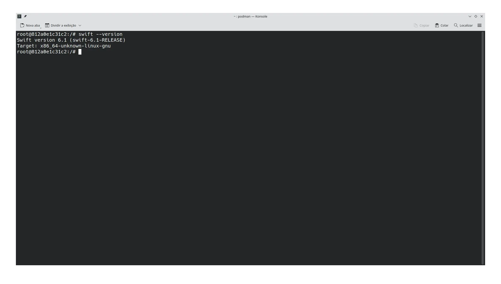

# Como utilizar a linguagem de programação Swift via Docker

> Também é possivel utilizar através do [Podman](https://podman.io/).

- [Docker Hub](https://hub.docker.com/_/swift).
- [Github - dockerfile](https://github.com/swiftlang/swift-docker/tree/main).

Baixar imagem Docker Hub:

```bash
docker pull \
swift
```

Crie um contêiner usando a tag `latest`:

```bash
docker run --privileged --interactive --tty \
--name swift-latest swift:latest /bin/bash
```

Inicie contêiner `swift-latest`:

```bash
docker start \
swift-latest
```

Conecte-se ao contêiner `swift-latest`:

```bash
docker attach \
swift-latest
```



## Extra

### Visual Studio Code

- [Swift](https://marketplace.visualstudio.com/items?itemName=swiftlang.swift-vscode).
- [Dev Containers](https://marketplace.visualstudio.com/items?itemName=ms-vscode-remote.remote-containers).