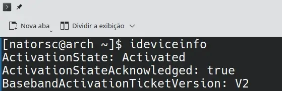
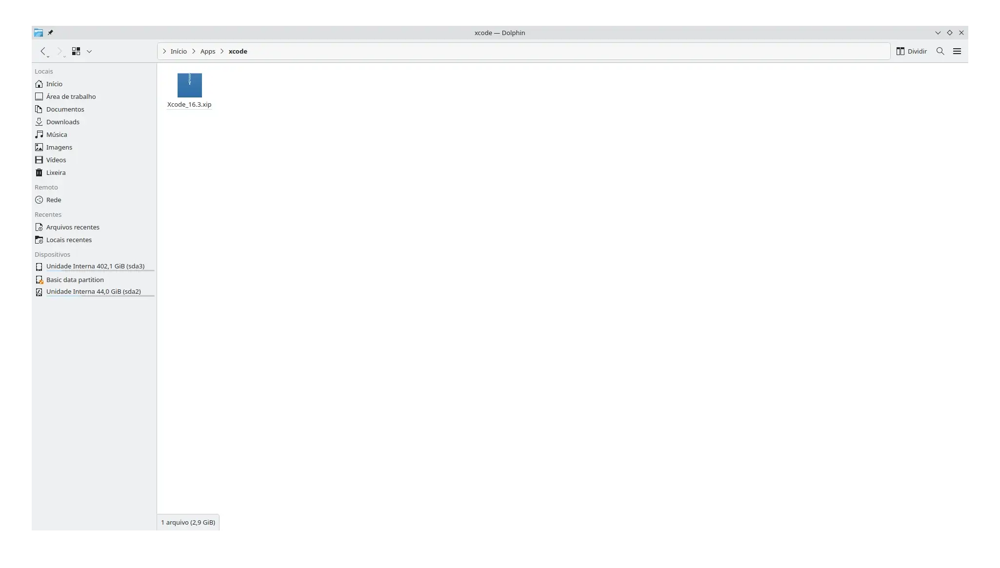

# Como desenvolver apps iOS no Windows e Linux com xtool

[xtool](https://github.com/xtool-org/xtool) é uma ferramenta que permite o desenvolvimento de aplicativos iOS no Micsoft Windows e em distribuições Linux eliminando a dependência do [Xcode](https://developer.apple.com/xcode/) e do [macOS](https://www.apple.com/br/macos/).

## Dependências

### Usbmuxd

A xtool depende do pacote `usbmuxd` para se comunicar com seu dispositivo iOS a partir do Linux.

> O pacote `libimobiledevice` é opcional.

#### Arch Linux

```bash
sudo pacman -S \
usbmuxd \
libimobiledevice
```

#### Fedora

```bash
sudo dnf install \
usbmuxd \
libimobiledevice-utils
```

#### Ubuntu

```bash
sudo apt install \
usbmuxd \
libimobiledevice-utils
```

Para verificar a comunicação USB entre a distribuição Linux e o iPhone utilize o comando:

```bash
ideviceinfo
```



## Xcode.xip

Baixe o Xcode em [https://developer.apple.com/services-account/download?path=/Developer_Tools/Xcode_16.3/Xcode_16.3.xip](https://developer.apple.com/services-account/download?path=/Developer_Tools/Xcode_16.3/Xcode_16.3.xip).

> Salve o arquivo em um local onde não será apagado e anote o caminho (`PATH`) onde o arquivo `Xcode_16.3.xip` foi salvo.

O URL acima requer autenticação, portanto, certifique-se de **acessá-lo no seu navegador**.

## Instalando o xtool

```bash
curl -fL \
  "https://github.com/xtool-org/xtool/releases/latest/download/xtool-$(uname -m).AppImage" \
  -o xtool
chmod +x xtool
sudo mv xtool /usr/local/bin/
```

Testando a instalação:

```bash
xtool --help
```

## Configurando o xtool

```bash
xtool setup
```

O terminal oferecerá 2 formas de log in:

```bash
Select login mode
0: API Key (requires paid Apple Developer Program membership)
1: Password (works with any Apple ID but uses private APIs)
Choice (0-1):
```

> Selecionando um modo de login
> 
> **Chave de API**: Se você possui uma assinatura paga do **programa de desenvolvedores da Apple**, esta é a opção recomendada. Ela se baseia na API pública do [App Store Connect](https://appstoreconnect.apple.com/). Siga as instruções para gerar uma **chave de equipe** com a função de **gerente de aplicativos**.
> 
> **Senha**: Se você não estiver inscrito no programa de desenvolvedores pago, use a autenticação baseada em senha. A autenticação depende de APIs privadas da Apple, portanto, talvez seja necessário criar um ID Apple descartável para ter mais cuidado.

Após efetuar login, será solicitado o caminho para o arquivo `Xcode.xip` que você baixou anteriormente:

```bash
Choice (0-1): 0
...
/Path/to/Xcode.xip:
```

Digite o caminho e pressione **Enter**.

O **xtool** extrairá o XIP do Xcode para gerar e instalar um SDK Swift para iOS.

Eu salvei o arquivo em `~/Apps/xcode/Xcode_16.3.xip`:



Para confirmar se a configuração foi realizada com sucesso:

```bash
swift sdk list
# darwin
```
